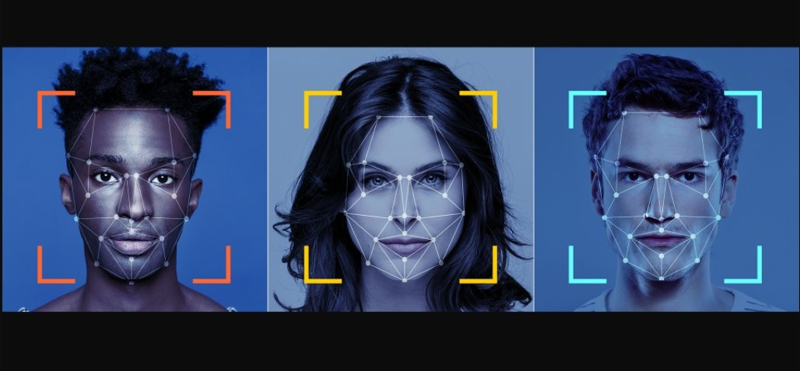
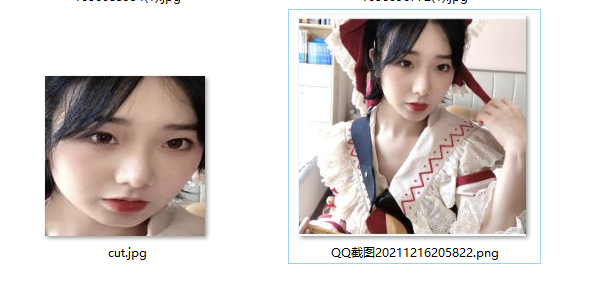
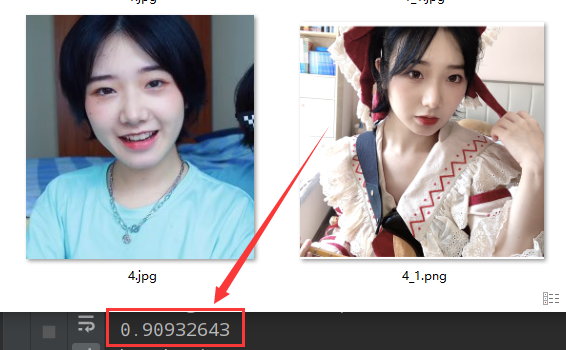
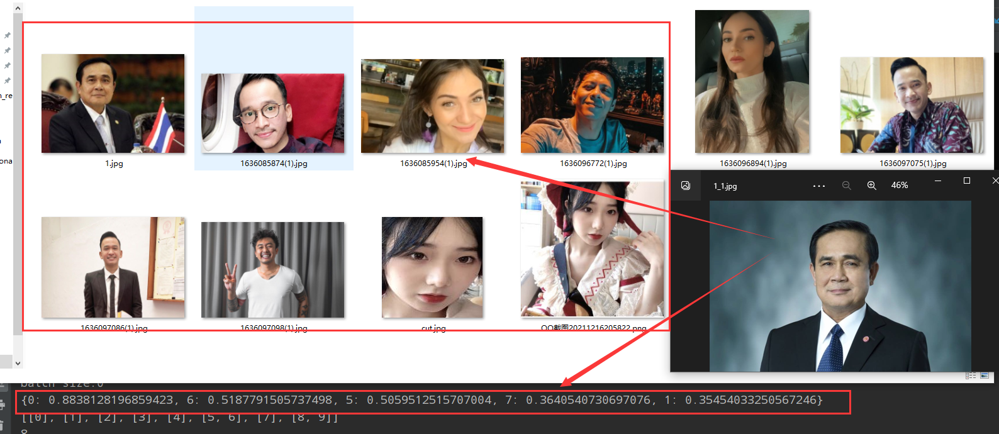
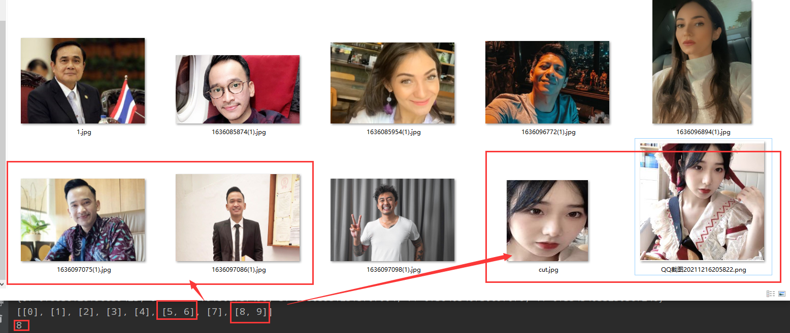

English | [简体中文](README_ch.md)

 

------------------------------------------------------------------------------------------

    
    
    

## 简介

FaceSearch旨在打造一套丰富、领先、且实用的人脸检测识别对比工具库，并应用落地。

**Recent updates**

- 将人脸探测出来，保存到指定文件路径中
- 将单张人脸进行编码，返回编码
- 对文件夹中的图片进行编码，返回编码矩阵(一行是一张人脸编码)
- 寻找最相似的人脸
- 已知id 求去重之后的人脸列表和人脸个数

## 特征
- FaceSearch一个高质量预训练模型，准确的识别效果
    - 基于vgg模型用私有数据集微调
    - 通用的FaceSearch模型：111.9M
    - 支持多种尺度大小的图片，清晰度较低图片同样适用
- 可运行于linux、windows等多种系统

## FaceSearch 系列模型

|模型|简介|下载地址|
|------------|---------------|---------------|
|facenet_vggface2.pt|vgg网络参数|[大小111.9M]()|
|face_detacher.pt/face_embedding.pt|FaceSearch参数(GPU)|[大小1.9M + 109.4M]()|
|face_detacher_cpu.pt/face_embedding_cpu.pt|FaceSearch参数(CPU)|[大小1.9M + 109.4M]()|

## 文档教程
- [运行环境准备](./doc/environment.md)
- [快速开始](./doc/quickstart.md)
- FaceSearch产业落地
    - [人脸探测](./xingqiuManga/xingManga.md)
    - [人脸编码](./xingqiuManga/xingManga.md)
    - [编码文件夹](./xingqiuManga/xingManga.md)
    - [寻找最相似的人脸](./xingqiuManga/xingManga.md)
    - [去重人脸](./xingqiuManga/xingManga.md)

- [联系作者](yupengxiong87@gmail.com)
  
## 效果展示

    <h5>人脸探测</h5>
    
     
    <h5>人脸相似度</h5>
    
     
    <h5>寻找最相似的人脸</h5>
    
     
    <h5>已知id 求去重之后的人脸列表和人脸个数</h5>
    

