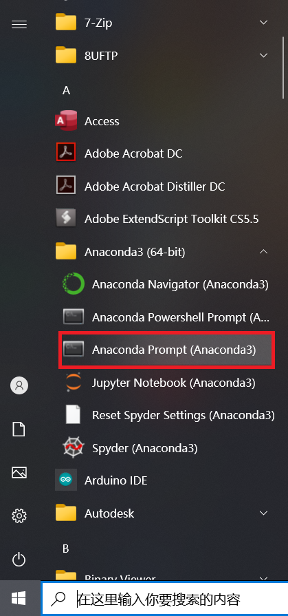
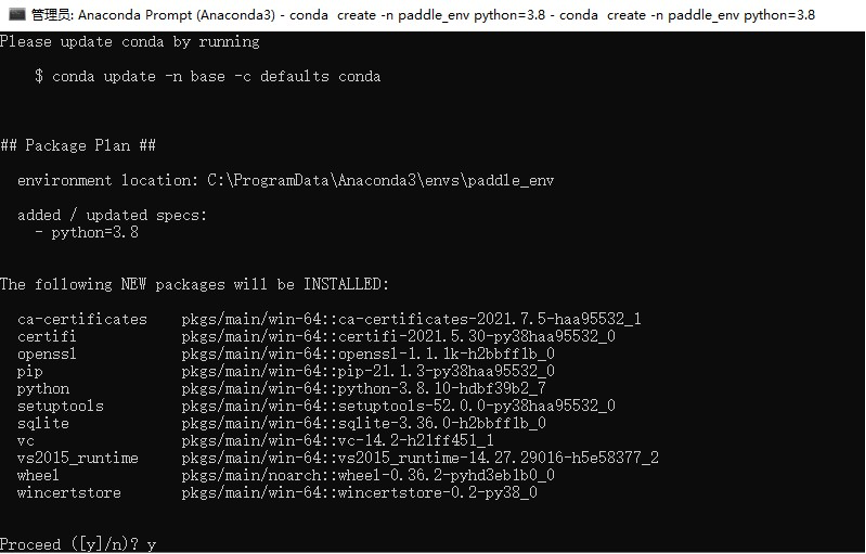
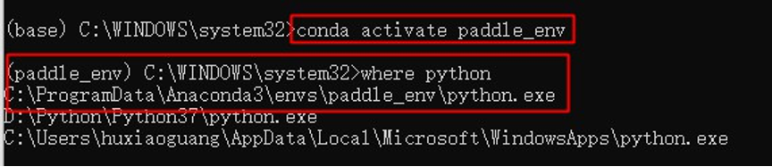
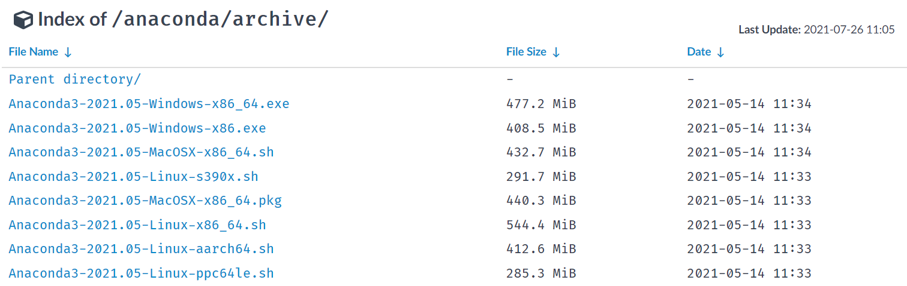
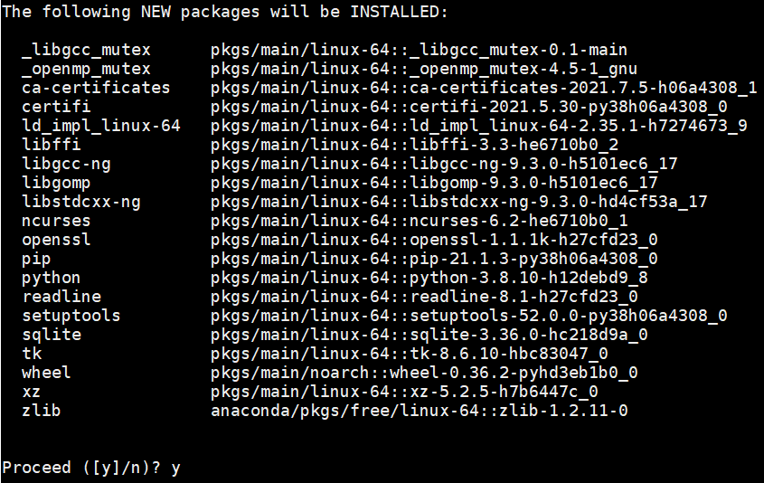

# 运行环境准备
Windows和Mac用户推荐使用Anaconda搭建Python环境

如果对于Python环境熟悉的用户可以直接跳到第2步安装FaceSearch。

* [1. Python环境搭建](#1)
  + [1.1 Windows](#1.1)
  + [1.2 Linux](#1.2)
* [2. 安装pytorch](#2)

<a name="1"></a>

## 1. Python环境搭建

<a name="1.1"></a>

### 1.1 Windows

#### 1.1.1 安装Anaconda

- 说明：使用FaceSearch需要先安装python环境，这里我们选择python集成环境Anaconda工具包
  - Anaconda是1个常用的python包管理程序
  - 安装完Anaconda后，可以安装python环境，以及numpy等所需的工具包环境。
- Anaconda下载：
  - 地址：https://mirrors.tuna.tsinghua.edu.cn/anaconda/archive/?C=M&O=D
  - 大部分win10电脑均为64位操作系统，选择x86_64版本；若电脑为32位操作系统，则选择x86.exe

    
  - 下载完成后，双击安装程序进入图形界面
  - 默认安装位置为C盘，建议将安装位置更改到D盘：

    
  - 勾选conda加入环境变量，忽略警告：

    

#### 1.1.2 打开终端并创建conda环境

- 打开Anaconda Prompt终端：左下角Windows Start Menu -> Anaconda3 -> Anaconda Prompt启动控制台

  


- 创建新的conda环境

  ```shell
  # 在命令行输入以下命令，创建名为facesearch的环境
  # 此处为加速下载，使用清华源
  conda create --name facesearch python=3.8 --channel https://mirrors.tuna.tsinghua.edu.cn/anaconda/pkgs/free/  # 这是一行命令
  ```

  该命令会创建1个名为facesearch、python版本为3.8的可执行环境，根据网络状态，需要花费一段时间

  之后命令行中会输出提示信息，输入y并回车继续安装

  

- 激活刚创建的conda环境，在命令行中输入以下命令：

  ```shell
  # 激活facesearch环境
  conda activate facesearch
  # 查看当前python的位置
  where python
  ```

    


以上anaconda环境和python环境安装完毕


<a name="1.2"></a>
### 1.2 Linux

Linux用户可选择Anaconda方式运行。

#### 1.2.1 Anaconda环境配置

- 说明：使用FaceSearch需要先安装python环境，这里我们选择python集成环境Anaconda工具包
  - Anaconda是1个常用的python包管理程序
  - 安装完Anaconda后，可以安装python环境，以及numpy等所需的工具包环境

- **下载Anaconda**：

  - 下载地址：https://mirrors.tuna.tsinghua.edu.cn/anaconda/archive/?C=M&O=D
    

    - 选择适合您操作系统的版本
    - 可在终端输入`uname -m`查询系统所用的指令集

- 下载法1：本地下载，再将安装包传到linux服务器上

- 下载法2：直接使用linux命令行下载

  ```shell
    # 首先安装wget
  sudo apt-get install wget  # Ubuntu
    sudo yum install wget  # CentOS
  ```

  ```shell
    # 然后使用wget从清华源上下载
  # 如要下载Anaconda3-2021.05-Linux-x86_64.sh，则下载命令如下：
    wget https://mirrors.tuna.tsinghua.edu.cn/anaconda/archive/Anaconda3-2021.05-Linux-x86_64.sh

  # 若您要下载其他版本，需要将最后1个/后的文件名改成您希望下载的版本
    ```

- 安装Anaconda：

  - 在命令行输入`sh Anaconda3-2021.05-Linux-x86_64.sh`
    - 若您下载的是其它版本，则将该命令的文件名替换为您下载的文件名
  - 按照安装提示安装即可
    - 查看许可时可输入q来退出

- **将conda加入环境变量**

  - 加入环境变量是为了让系统能识别conda命令，若您在安装时已将conda加入环境变量path，则可跳过本步

  - 在终端中打开`~/.bashrc`：

    ```shell
    # 在终端中输入以下命令：
    vim ~/.bashrc
    ```

  - 在`~/.bashrc`中将conda添加为环境变量：

    ```shell
    # 先按i进入编辑模式
    # 在第一行输入：
    export PATH="~/anaconda3/bin:$PATH"
    # 若安装时自定义了安装位置，则将~/anaconda3/bin改为自定义的安装目录下的bin文件夹
    ```

     ```shell
      # 修改后的~/.bash_profile文件应如下（其中xxx为用户名）：
      export PATH="~/opt/anaconda3/bin:$PATH"
      # >>> conda initialize >>>
      # !! Contents within this block are managed by 'conda init' !!
      __conda_setup="$('/Users/xxx/opt/anaconda3/bin/conda' 'shell.bash' 'hook' 2> /dev/null)"
      if [ $? -eq 0 ]; then
          eval "$__conda_setup"
      else
          if [ -f "/Users/xxx/opt/anaconda3/etc/profile.d/conda.sh" ]; then
              . "/Users/xxx/opt/anaconda3/etc/profile.d/conda.sh"
          else
              export PATH="/Users/xxx/opt/anaconda3/bin:$PATH"
          fi
      fi
      unset __conda_setup
      # <<< conda initialize <<<
     ```

    - 修改完成后，先按`esc`键退出编辑模式，再输入`:wq!`并回车，以保存退出

  - 验证是否能识别conda命令：

    - 在终端中输入`source ~/.bash_profile`以更新环境变量
    - 再在终端输入`conda info --envs`，若能显示当前有base环境，则conda已加入环境变量

- 创建新的conda环境

   ```shell
   # 在命令行输入以下命令，创建名为facesearch的环境
   # 此处为加速下载，使用清华源
   conda create --name facesearch python=3.8 --channel https://mirrors.tuna.tsinghua.edu.cn/anaconda/pkgs/free/
   ```

  - 该命令会创建1个名为facesearch、python版本为3.8的可执行环境，根据网络状态，需要花费一段时间

  - 之后命令行中会输出提示信息，输入y并回车继续安装

    

- 激活刚创建的conda环境，在命令行中输入以下命令：

  ```shell
  # 激活facesearch环境
  conda activate facesearch
  ```

以上anaconda环境和python环境安装完毕


## 2.安装pytorch

- 说明：使用anaconda需要先安装pytorch环境
  - PyTorch是一个Python的开源机器学习库。它用于自然语言处理等应用程序。它最初由Facebook人工智能研究小组开发，而优步的Pyro软件则用于概率编程。
  [更多请阅读](https://www.yiibai.com/pytorch/pytorch_introduction.html)
  - 激活faceserch环境安装pytorch
  
  ```
  conda activate facesearch
  conda install pytorch torchvision torchaudio cudatoolkit=11.3 -c pytorch
  ```
  [更多请阅读](https://pytorch.org/)

  


